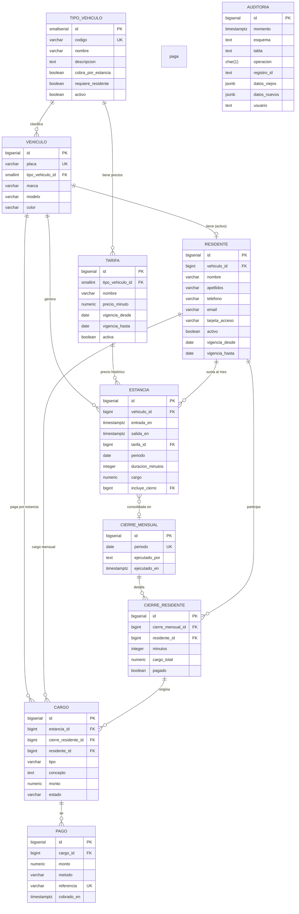

# Modelo de datos — Sistema de control de acceso vehicular

> Parte 1 de la prueba técnica DBA Neology. Detalle del diseño en `database/schema.sql`.

## 1. Objetivo

Modelar un estacionamiento que registra **entradas y salidas de vehículos**,
**calcula cobros** según el tipo de vehículo, acumula **cargos mensuales de
residentes**, genera **reportes y cierres mensuales** y conserva **trazabilidad
histórica y auditoría** de las operaciones relevantes.

## 2. Decisiones de diseño (supuestos)

| # | Decisión | Justificación |
|---|----------|---------------|
| D1 | **Zona horaria de negocio única**: `America/Mexico_City`, centralizada en `parking.zona_negocio()`. | "Día" y "mes" deben ser uniformes para facturación/reportes, independientes de la zona de la sesión o de la app. |
| D2 | Fechas almacenadas como `TIMESTAMPTZ`. | Guarda el instante absoluto (UTC) y se proyecta a la zona de negocio para cálculos. Evita ambigüedad por huso del origin de los datos. |
| D3 | Columna `estancia.periodo` (mes, primer día) asignada por **trigger** según la zona de negocio. | Permite agrupar por mes, cierres mensuales y **particionamiento RANGE** por mes. Los `GENERATED` no admiten `AT TIME ZONE` (no es inmutable). |
| D4 | **Una estancia abierta por vehículo** = índice único parcial `uq_estancia_abierta_por_vehiculo`. | Regla de negocio explícita, garantizada a nivel de BD, imposible de violar incluso con concurrencia. |
| D5 | La **tarifa se captura en la estancia** (`estancia.tarifa_id`) y no se re-calculan los importes vía tarifa vigente al consultar. | Conserva el **precio histórico**: si mañana cambia la tarifa, las estancias pasadas no se revalorizan. |
| D6 | `duracion_minutos` y `cargo` se **almacenan** (desnormalización controlada) al registrar la salida, con `CHECK` que valida coherencia contra el cálculo. | Al haber millones de filas, los reportes no recalculan duración/importe en cada lectura. La integridad se defiende con restricciones. |
| D7 | Tipos de vehículo y tarifas son **datos, no código**. | "Agregar nuevos tipos/tarifas" = `INSERT` (parte 1, requerimiento de extensibilidad). |
| D8 | Un **residente = un vehículo** (pase). Histórico con `vigencia_desde/vigencia_hasta` y único activo por vehículo. | Modelo de placa de estacionamiento por vehículo; permite dar de baja/reactivar sin borrar. |
| D9 | Esquemas separados `parking` (negocio) y `auditoria` (trazabilidad). | Facilita seguridad por esquema (Parte 5) y retención de la bitácora. |
| D10 | Cierra mensual por **mes de entrada** de la estancia. Estancias que cruzan la frontera del mes se consolidan completas en su mes de entrada. | Decisión simple y auditable; el prorrateo por día se documenta como mejora (A1). |
| D11 | El cobro del visitante se genera como `cargo` **al registrar la salida**; el residente acumula y se le cobra en el **cierre mensual** (cargo `MENSUAL`). | Alineado con las reglas de cobro (oficial no paga; visitante paga al salir; residente pagará su acumulado mensual). |
| D12 | `pago` referencia un único `cargo` con `UNIQUE(referencia)`. | Evita doble pago de la misma transacción (idempotencia). |
| D13 | Auditoría **append-only** con disparadores `SECURITY DEFINER`. | La aplicación puede seguir escribiendo el negocio mientras no toca la bitácora; la bitácora no se modifica/borra. |
| D14 | Identidad de negocio vía GUC `app.v_usuario`. | La bitácora registra "quién operativo" (usuario de la app) y no el usuario técnico de conexión. |

## 3. Diagrama entidad-relación (Mermaid)

## 4. Tablas y restricciones clave

| Tabla | PK | Unicidades / parciales | CHECKs / reglas en BD |
|---|---|---|---|
| `tipo_vehiculo` | `id` | `codigo` | `codigo <> ''` |
| `tarifa` | `id` | `(tipo_vehiculo_id, nombre)` | `precio_minuto >= 0`; vigencia coherente |
| `vehiculo` | `id` | `placa` | placa no vacía |
| `residente` | `id` | único `vehiculo_id` **activo** (parcial) | vigencia coherente |
| `estancia` | `id` | `uq_estancia_abierta_por_vehiculo` (parcial, salida NULL) | salida > entrada; `periodo` = mes de entrada (zona negocio); almacenados vs calculados coherentes; abierta ⇒ sin duración/cargo |
| `cierre_mensual` | `id` | `periodo` | — |
| `cierre_residente` | `id` | `(cierre_mensual_id, residente_id)` | minutos>=0, cargo>=0 |
| `cargo` | `id` | — | tipo/estado en dominio; **origen**: `estancia_id` o `cierre_residente_id` no nulos |
| `pago` | `id` | `referencia` | monto>0; método en dominio |
| `auditoria.auditoria` | `id` | — | operación ∈ I/U/D |

**Triggers**
- `trg_estancia_periodo`: asigna `periodo` (mes) según zona de negocio.
- Triggers de auditoría (`I`/`U`/`D`) sobre todas las tablas de negocio; función `auditoria.fn_auditar()` de tipo `SECURITY DEFINER`.

## 5. Índices iniciales (`schema.sql`)

| Índice | Tabla | Columnas | Para qué sirve |
|---|---|---|---|
| `uq_estancia_abierta_por_vehiculo` (único, parcial) | estancia | `vehiculo_id WHERE salida IS NULL` | Regla "1 estancia abierta"; además consulta "quién está dentro" |
| `ix_estancia_vehiculo` | estancia | `vehiculo_id` | FK y joins por vehículo |
| `ix_estancia_tarifa` | estancia | `tarifa_id` | FK |
| `ix_estancia_entrada` | estancia | `entrada_en` | rango de entradas |
| `ix_estancia_periodo_vehiculo` | estancia | `periodo, vehiculo_id` | reportes/cierres por mes y joins |
| `ix_estancia_vehiculo_salida` | estancia | `vehiculo_id, salida_en` | "tiempo acumulado por vehículo" |
| `ix_tarifa_tipo_activa` | tarifa | `tipo_vehiculo_id, activa, vigencia_desde` | tarifa vigente |
| `ix_cargo_*`, `ix_pago_cargo` | cargo/pago | FKs | joins |
| `ix_auditoria_*` | auditoria | `(tabla, momento)`, `registro_id` | trazabilidad |

La **optimización específica** para volumen (millones de filas) con índices
cubrientes, parciales y análisis de planes está en `database/indexes.sql` y
`docs/performance-analysis.md`.

## 6. Estrategia de información histórica

- **Nunca se elimina** información de negocio: alta/baja de residentes por
  `activo` + vigencia; estancias permanecen; cierres son acumulativos.
- El **cierre mensual** marca las estancias con `estancia.incluye_cierre` y
  copia el agregado por residente en `cierre_residente` + el cargo `MENSUAL`;
  el histórico del mes anterior queda íntegro y trazable.
- La **auditoría** guarda un antes/después (`jsonb`) de cada cambio relevante,
  con quién, cuándo y la operación — suficiente para reconstruir estados.
- Guardería de respaldos física+lógica: `docs/backup-recovery.md`.

## 7. Régimen de negocio a partir del modelo

| Tipo | `cobra_por_estancia` | `requiere_residente` | Cobro |
|---|---|---|---|
| `OFICIAL` | `false` | `false` | $0.00 (tarifa oficial) |
| `RESIDENTE` | `false` | `true` | $0.05/min acumulado; cargo `MENSUAL` en el cierre |
| `VISITANTE` (no residente) | `true` | `false` | $0.50/min, cargo `ESTANCIA` al registrar salida |

Nuevos tipos/tarifas se agregan con `INSERT` a `tipo_vehiculo` + `tarifa`
(vigencia y precio por minuto verificados por `fn_tarifa_vigente`).

## 8. Limitaciones conocidas y mejoras (A)

| Id | Limitación / mejora | Estado |
|---|---|---|
| A1 | Prorrateo de estancias que cruzan la frontera del mes (minutos en cada mes). Hoy se consolidan en el mes de entrada. | Propuesta: tabla de "segmentos de estancia" o función de distribución en el cierre. |
| A2 | Un residente por vehículo. Personas con 2 autos requieren 2 pases. | Paso a `residente(1)—(N) vehiculo` con `residente_id` en vehículo. |
| A3 | `cargo` no tiene control de si el visitante paga antes de abandonar (controles externos del kiosco). | Añadir trigger de "checkout validado" en producción. |
| A4 | La auditoría crece linealmente; se propone archivado y movida a la BD no relacional (Parte 8). | Ver `docs/nosql-design.md`. |
| A5 | No hay tabla de usuarios autenticados; la identidad es la GUC `app.v_usuario`. | En producción proveerla vía conexión de la aplicación (pool con usuario por persona si aplica). |